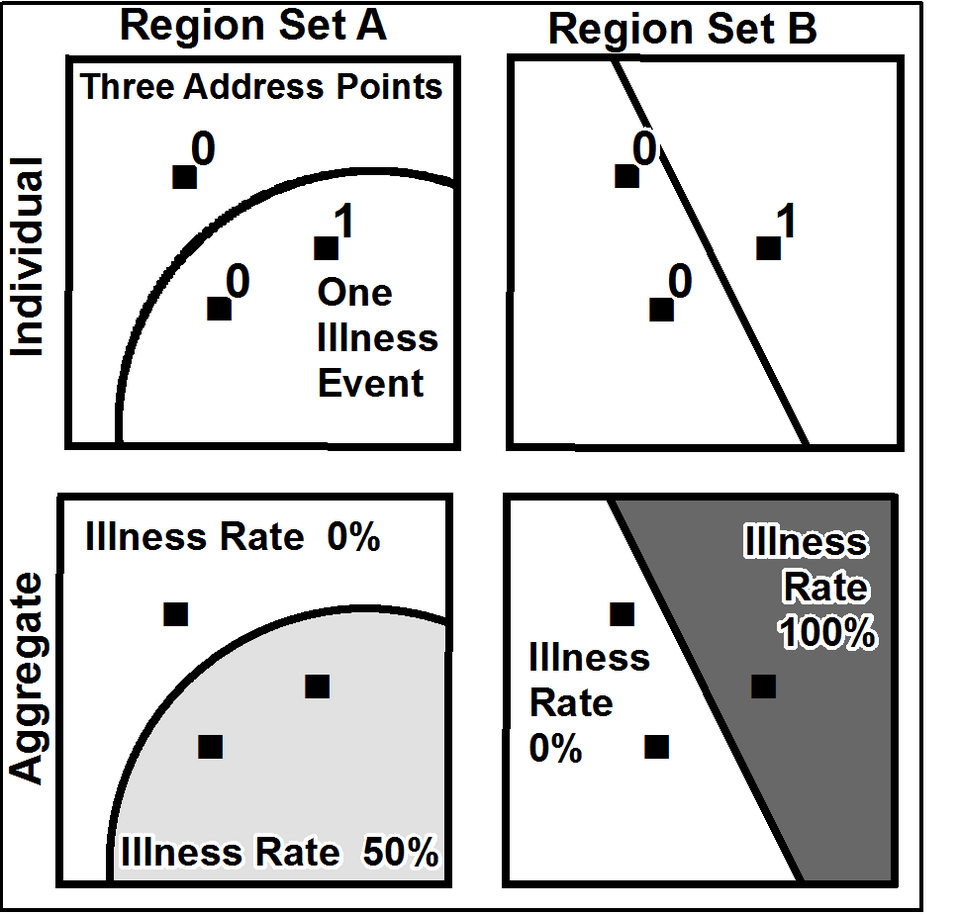

# Données géolocalisées

## L'offre crée sa propre demande {.smaller}

- Généralisation de traces numériques géolocalisées :
    + Multiplication des acteurs (production & exploitation)
    + Données mobile, GPS, localisation d'adresses IP, géolocalisation d'adresses...

. . .

- Recherche et statistique publique :
    + Intérêt ancien : enquêtes des sociologues du XIXe, école de Chicago (années 1920) mais données limitées
    + Années 2010 : quantification de masse de phénomènes <del>spatiaux</del> sociaux : déplacements, lieux fréquentés...
    + Statistique publique s'adapte en publiant des données fines ([données carroyées](https://www.insee.fr/fr/statistiques/6215168?sommaire=6215217)...)

 

Références

* Roth Camille. 2019. “[Digital, Digitized, and Numerical Humanities.](https://academic.oup.com/dsh/article-abstract/34/3/616/5161109)” _Digital Scholarship in the Humanities_ 
* Ash J, Kitchin R, Leszczynski A. 2018. “[Digital turn, digital geographies ?](https://journals.sagepub.com/doi/10.1177/0309132516664800)” _Progress in Human Geography_
* Einav, L., & Levin, J. (2014). _Economics in the age of big data_. _Science_, 346(6210), 1243089.

## Un enjeu ancien

## Un enjeu ancien

John Snow cartographie le choléra à Londres

<!--  -->

## Un enjeu ancien... et actuel

::: {#fig-elephants layout-ncol=2}

)](./img/pop.png)

:::

## Un enjeu actuel {.smaller}

## Un enjeu actuel {.smaller}

.](https://inseefrlab.github.io/cours-nouvelles-donnees-site/img/geolocalized_data/carte_densite.png)

Voir [geoportail](https://www.geoportail.gouv.fr/),
[statistiques-locales.insee.fr](https://statistiques-locales.insee.fr)
ou [France Pixel](https://www.comeetie.fr/galerie/francepixels/#map/revenus/vardefault/7/46.977/3.384)
par Etienne Côme

## Un enjeu actuel {.smaller}

<iframe width="100%" height="452" frameborder="0"
  src="https://observablehq.com/embed/fc6619f32c215ce9?cells=container"></iframe>

Un exemple de visualisation _express_ des données Filosofi grâce à 
la librairie  `gridviz` (visible sur [Observable](https://observablehq.com/d/fc6619f32c215ce9?collection=@jgaffuri/gridviz))

## Quels apports ? {.smaller}

- Calculer des indicateurs avec une granularité spatiale plus fine que les découpages administratifs ou historiques classiques :
    + Etudes territoriales
    + Aide pour les acteurs publics
    + Source d'information de contexte pour tous les acteurs (publics & privés)

. . .

- Éclairer des phénomènes socio-économiques très locaux : 
    + Problématiques de mixité [@galiana2020segregation]
    + Concentration immobilière liée au niveau de vie [@andre-21]
    + Localisation intra-communale des cambriolages de logements [@pramil2020cambri].

. . .

- Réaliser des _dataviz_ plus engageantes pour le public
    + Carte : _dataviz_ connue et compréhensible par un large spectre de publics

## Exemple : données de téléphonie mobile

1. Call Detail Records (CDR)
    + Générés lors des communications actives d'un utilisateur à travers son téléphone mobile (appel, envoi de SMS, etc.)
2. Données de signalisation passive :
    + Issues des connexions _data_ automatiques
    + Collectées par les opérateurs principalement à des fins d'optimisation et de surveillance de leurs réseaux
    + Fréquence temporelle >> données CDR.

## Exemple : données de téléphonie mobile (CDR) {.smaller}

- Statistiques intéressantes sur les populations présentes et les déplacements de la population
    + @galiana-20 : mouvements de population avant/après le confinement de 2020

{fig-align="center"}

## Exemple : données de signalisation {.smaller}

- Article _Journal of official statistics_

{fig-align="center"}

## Exemple : enjeux

- Questions sur la [**qualité**]{.orange} : 
    - **biais de sélection** à corriger ? (exemple : clients d'Orange)

. . .

- Questions sur la [**pérennité**]{.orange} : 
    - Pas de garantie sur la pérénité des formats, méthodes de collection des données. 
    - Donc, pas de garantie que les indicateurs restent comparables au cours du temps.

## Exemple : enjeux {.smaller}

- Questions d'[**éthique**]{.orange} : 
    - avant d'utiliser ces données personnelles, 
        - usage proportionné ? 
        - valeur ajoutée des statistiques produites pour la population ?

. . .

- Questions [**légales**]{.orange} : 
    - Historiquement : accès limité aux données téléphoniques (et aux données privées en général) pour les statistiques
    - [Révision du règlement 223/2009](https://www.casd.eu/modification-du-reglement-statistique-europeen-223-09-des-evolutions-importantes-pour-lacces-aux-sources-privees/) fin 2024 : accès désormais possible, sous conditions strictes
    - Protection des données personnelles toujours requises (RGPD)

## Autres exemples de données géolocalisées

- `Fideli` (Fichier démographique sur les logements et les individus)
- `Filosofi` (Fichier localisé social et fiscal)
- `BPE` (Base permanente des équipements)
- `Sirene` (répertoire des entreprises)
- `RP` (Recensement de la Population)

- Généralement, `RIL` et `Cadastre` comme [source première de la géolocalisation]{.orange}

## Application

- Application sur le [site web du cours](https://inseefrlab.github.io/cours-nouvelles-donnees-site/geolocalized_data_exemples.html)
sur données de transactions immobilières 💰💸🏠
- Manipuler les données spatiales DVF et les données carroyées de l'Insee avec  et `DuckDB`
- ✍🏻 [**Lien vers le TD**](https://inseefrlab.github.io/cours-nouvelles-donnees-site/applications/application1.html) 
