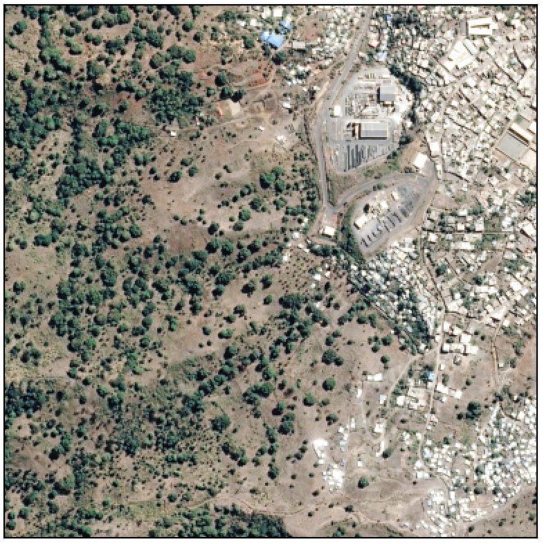
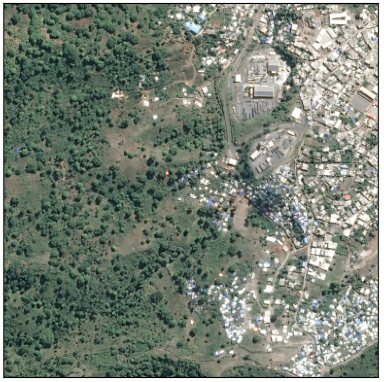
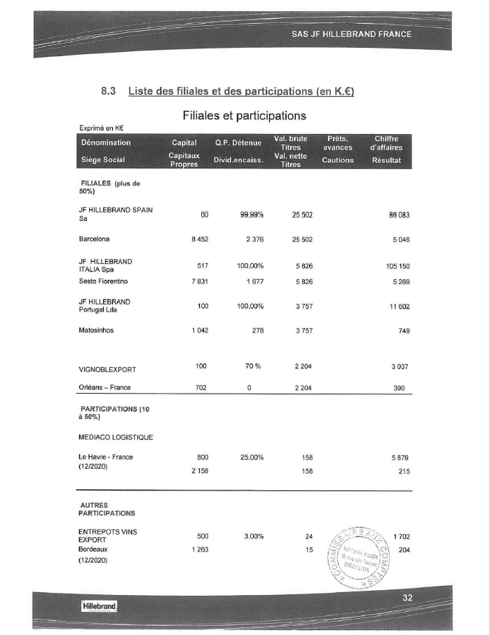
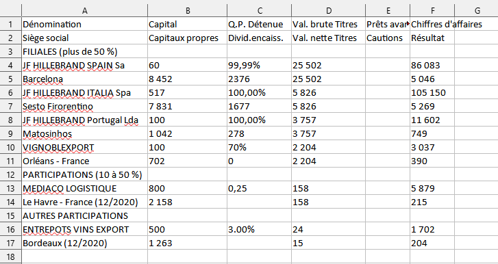

# Analyse d'images

## EO data (1/2)

- [**Cas d'usage**]{.orange} potentiels multiples: supervision des forêts, de l’agriculture, des masses d’eau, supervision de l'urbanisation et des infrastructures, étude de la pollution environnementale, etc.
- Aujourd'hui: 
    - Calcul de statistiques sur [**l’occupation et l’usage des sols**]{.blue2} (consolidation de l'enquête Teruti)
    - Consolidation des [**statistiques sur les vergers**]{.blue2} issues de l'enquête sur la structure des exploitations agricoles
    - Mise à jour du [**répertoire de logements**]{.blue2} dans les DROM

## EO data (2/2)

:::: {.columns}

::: {.column width="50%"}

:::

::: {.column width="50%"}

:::

::::

## OCR et extraction (1/2)

- OCR: [**reconnaissance optique de caractères**]{.orange}
- Documents scannés ou photographiés exploitables pour la statistique publique:
    - Comptes [**annuels des entreprises**]{.blue2}
    - [**Permis de construire**]{.blue2}
    - Photographies de [**tickets de caisse**]{.blue2} pour l'enquête Budget de Famille
- Extraction d'information structurée: cas des [**tableaux**]{.orange}

## OCR et extraction (2/2)

:::: {.columns}

::: {.column width="50%"}

:::

::: {.column width="50%"}

:::

::::

